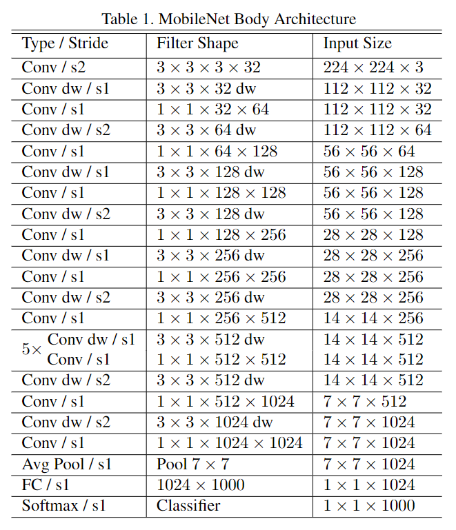
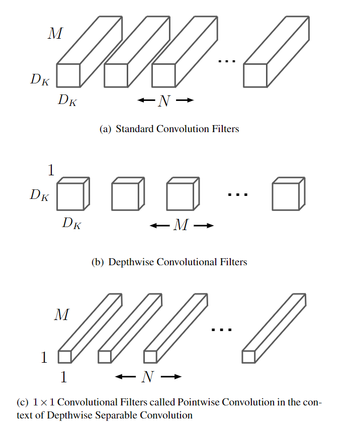
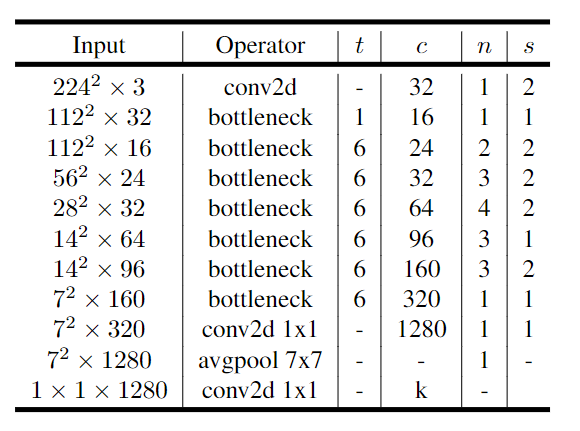
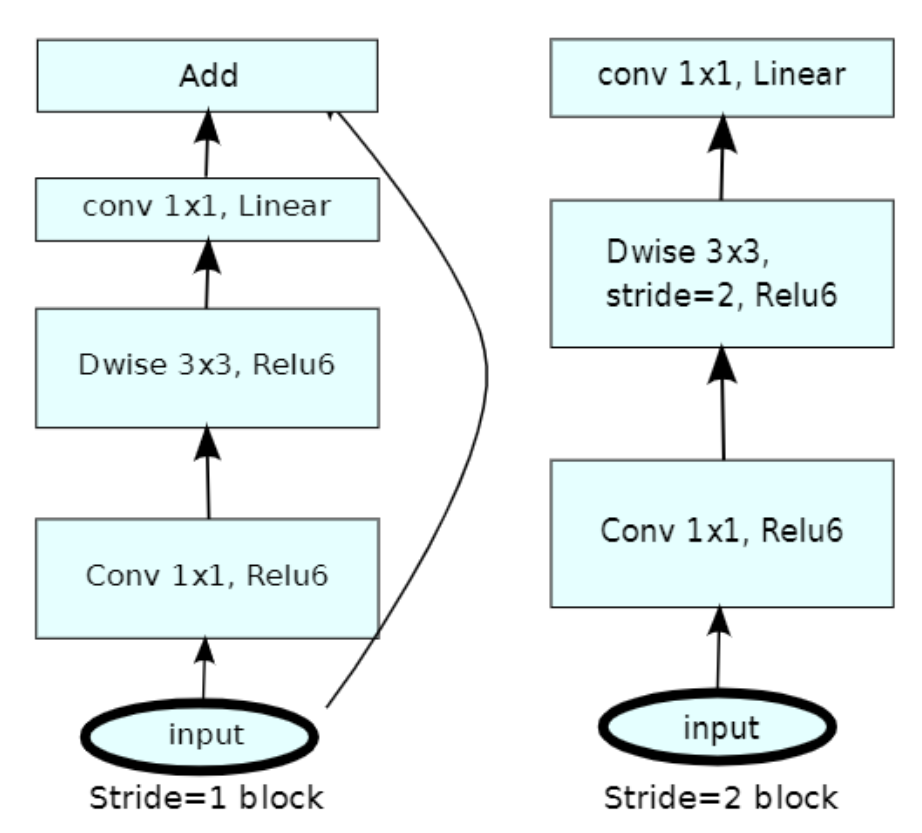
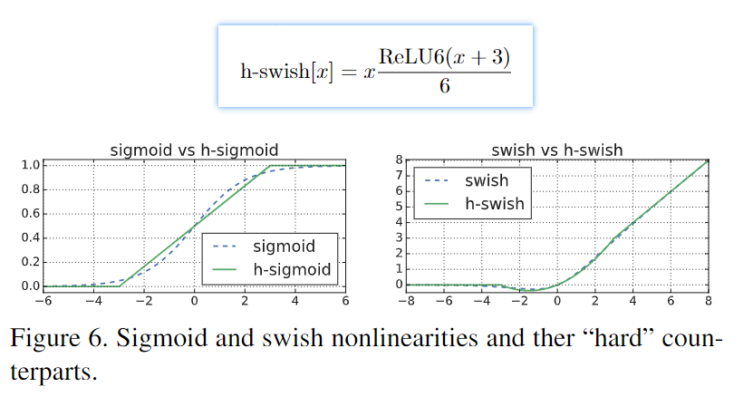
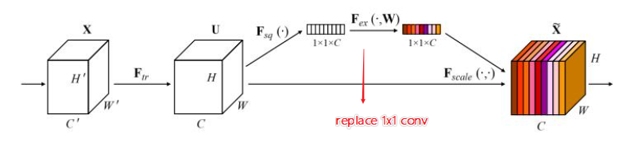
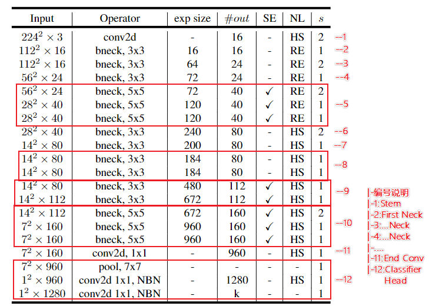
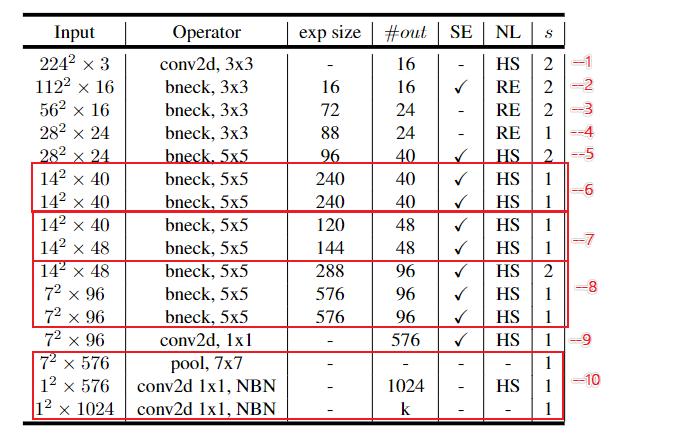

# The-MobileNet-line-of-work-by-PaddlePaddle
The MobileNet line of work by PaddlePaddle

- **MobileNet(V1)** 模型复现源码: <a href="./mobilenet.py">`mobilenet.py`</a>
    <table>
        <tr>
            <td align="center">V1网络结构</td>
            <td align="center">深度分离卷积</td>
        </tr>
        <tr>
            <td align="center"></td>
            <td align="center"></td>
        </tr>
    </table>
    
    - `done date`: `2021-11-12`
    - 构建模型接口说明:
 
        - `MobileNet`: 构建模型的基类
        - `MobileNet_Base`: 构建**基础**MobileNet的函数
        - `MobileNet_0_75`: 构建**较大**MobileNet的函数
        - `MobileNet_Mid`: 构建**中等**MobileNet的函数
        - `MobileNet_Small`: 构建**最小**MobileNet的函数

- **MobileNetV2** 模型复现源码: <a href="./mobilenetV2.py">`mobilenetV2.py`</a>
    <table>
        <tr>
            <td align="center">V2网络结构</td>
            <td align="center">倒残差结构</td>
        </tr>
        <tr>
            <td align="center"></td>
            <td align="center"></td>
        </tr>
    </table>
    
    - `done date`: `2021-11-12`
    - 构建模型接口说明:
 
        - `MobileNetV2`: 构建模型的基类
        - `MobileNetV2_for_224`: 构建**最适合224大小图像**的MobileNetV2的函数
        - `MobileNetV2_Base`: 构建**基础**MobileNetV2的函数
        - `MobileNetV2_0_75`: 构建**较大**MobileNetV2的函数
        - `MobileNetV2_Mid`: 构建**中等**MobileNetV2的函数
        - `MobileNetV2_Small`: 构建**最小**MobileNetV2的函数

- **MobileNetV3** 模型复现源码: <a href="./mobilenetV3.py">`mobilenetV3.py`</a>
    <table>
        <tr>
            <td align="center">V3激活函数</td>
            <td align="center">V3注意力SE模块</td>
        </tr>
        <tr>
            <td align="center"></td>
            <td align="center"></td>
        </tr>
    <tr>
            <td align="center">V3-Large结构</td>
            <td align="center">V3-Small结构</td>
        </tr>
        <tr>
            <td align="center"></td>
            <td align="center"></td>
        </tr>
    </table>
    
    - `done date`: `2021-11-12`
    - 构建模型接口说明:
 
        - `MobileNetV3_Large`: 构建Large模型的基类
        - `MobileNetV3_Large_for_224`: 构建**最适合224大小图像**的MobileNetV3_Large的函数
        - `MobileNetV3_Large_Base`: 构建**基础**MobileNetV3_Large的函数
        - `MobileNetV3_Large_0_75`: 构建**较大**MobileNetV3_Large的函数
        - `MobileNetV3_Large_Mid`: 构建**中等**MobileNetV3_Large的函数
        - `MobileNetV3_Large_Small`: 构建**最小**MobileNetV3_Large的函数
        - `MobileNetV3_Small`: 构建Small模型的基类
        - `MobileNetV3_Small_for_224`: 构建**最适合224大小图像**的MobileNetV3_Small的函数
        - `MobileNetV3_Small_Base`: 构建**基础**MobileNetV3_Small的函数
        - `MobileNetV3_Small_0_75`: 构建**较大**MobileNetV3_Small的函数
        - `MobileNetV3_Small_Mid`: 构建**中等**MobileNetV3_Small的函数
        - `MobileNetV3_Small_Small`: 构建**最小*MobileNetV3_Small的函数

- **Mobile-Former** 模型复现源码: `mobileformer.py` -- To Do
