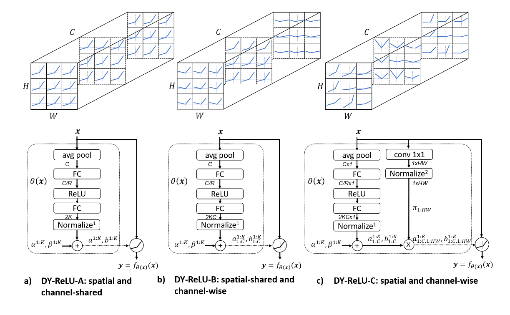
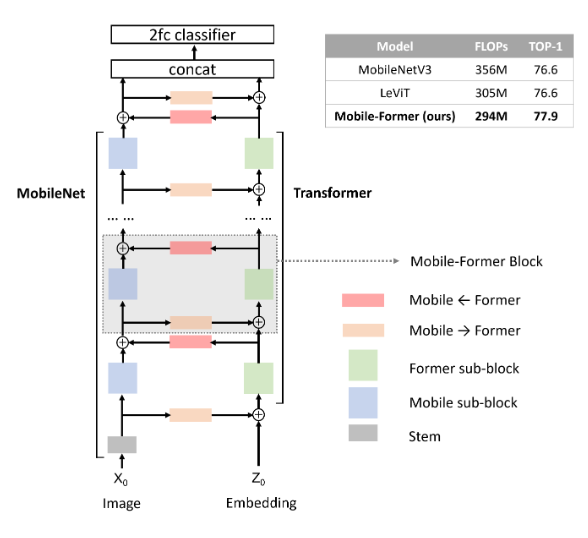
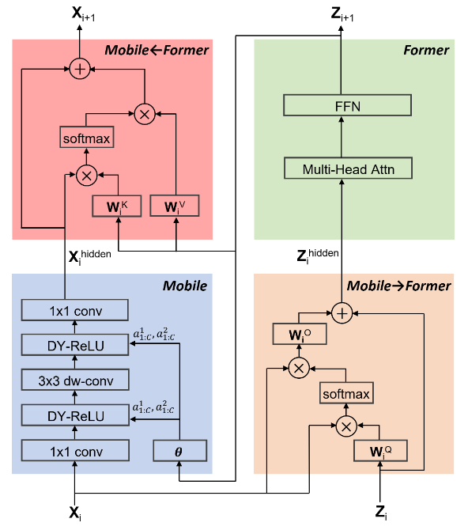
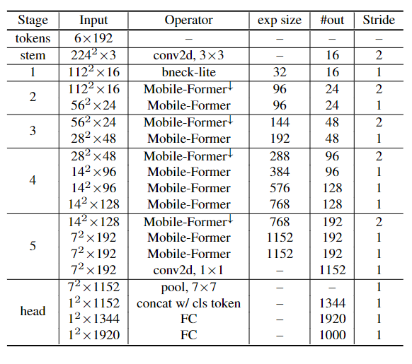

# The-MobileNet-line-of-work-by-PaddlePaddle
The MobileNet line of work by PaddlePaddle

- **MobileNet(V1)** 模型复现源码: <a href="./mobilenet.py">`mobilenet.py`</a>
    <table>
        <tr>
            <td align="center">V1网络结构</td>
            <td align="center">深度分离卷积</td>
        </tr>
        <tr>
            <td align="center"></td>
            <td align="center"></td>
        </tr>
    </table>
    
    - `done date`: `2021-11-12`
    - 模型结构(组网)类型:
    
        - `DepthWise_Conv`: 深度卷积--每个通道分配单个卷积核并输出，in_channels=out_channels
        - `PointWise_Conv`: 逐点卷积--1x1卷积
        - `Depth_Separ_Conv`: 深度可分离卷积--`深度卷积`+`逐点卷积`, 输出经过relu，非线性输出
        - `Stem`: 渐入层--进行第一次图像的特征提取，空间信息转换
        - `Classifier_Head`: 分类头--输出分类结果
        - `MobileNet`: 组网实现

    - 构建模型接口说明:
 
        - `MobileNet`: 构建模型的基类
        - `MobileNet_Base`: 构建**基础**MobileNet的函数
        - `MobileNet_0_75`: 构建**较大**MobileNet的函数
        - `MobileNet_Mid`: 构建**中等**MobileNet的函数
        - `MobileNet_Small`: 构建**最小**MobileNet的函数

- **MobileNetV2** 模型复现源码: <a href="./mobilenetV2.py">`mobilenetV2.py`</a>
    <table>
        <tr>
            <td align="center">V2网络结构</td>
            <td align="center">倒残差结构</td>
        </tr>
        <tr>
            <td align="center"></td>
            <td align="center"></td>
        </tr>
    </table>
    
    - `done date`: `2021-11-12`
    - 模型结构(组网)类型:
    
        - `DepthWise_Conv`: 深度卷积--每个通道分配单个卷积核并输出，in_channels=out_channels
        - `PointWise_Conv`: 逐点卷积--1x1卷积
        - `Linear_Depth_Separ_Conv`: 深度可分离卷积--`深度卷积`+`逐点卷积`, 输出不经过relu等，线性输出
        - `BottleNeck`: 倒残差模块--低密度空间残差
        - `Stem`: 渐入层--进行第一次图像的特征提取，空间信息转换
        - `Classifier_Head`: 分类头--输出分类结果
        - `MobileNetV2`: 组网实现
    
    - 构建模型接口说明:
 
        - `MobileNetV2`: 构建模型的基类
        - `MobileNetV2_for_224`: 构建**最适合224大小图像**的MobileNetV2的函数
        - `MobileNetV2_Base`: 构建**基础**MobileNetV2的函数
        - `MobileNetV2_0_75`: 构建**较大**MobileNetV2的函数
        - `MobileNetV2_Mid`: 构建**中等**MobileNetV2的函数
        - `MobileNetV2_Small`: 构建**最小**MobileNetV2的函数

- **MobileNetV3** 模型复现源码: <a href="./mobilenetV3.py">`mobilenetV3.py`</a>
    <table>
        <tr>
            <td align="center">V3激活函数</td>
            <td align="center">V3注意力SE模块</td>
        </tr>
        <tr>
            <td align="center"></td>
            <td align="center"></td>
        </tr>
    <tr>
            <td align="center">V3-Large结构</td>
            <td align="center">V3-Small结构</td>
        </tr>
        <tr>
            <td align="center"></td>
            <td align="center"></td>
        </tr>
    </table>
    
    - `done date`: `2021-11-12`
    - 模型结构(组网)类型:
    
        - `Identify`: 占位符--不做任何操作, x=f(x)
        - `DepthWise_Conv`: 深度卷积--每个通道分配单个卷积核并输出，in_channels=out_channels
        - `PointWise_Conv`: 逐点卷积--1x1卷积
        - `Linear_Depth_Separ_Conv`: 深度可分离卷积--`深度卷积`+`逐点卷积`, 输出不经过relu等，线性输出
        - `SEBlock`: SE Attention计算模块--channels注意力
        - `BottleNeck`: 倒残差模块--低密度空间残差
        - `Stem`: 渐入层--进行第一次图像的特征提取，空间信息转换
        - `Classifier_Head`: 分类头--输出分类结果
        - `MobileNetV3_Large`: Large结构的组网实现
        - `MobileNetV3_Small`: Small结构的组网实现
    
    - 构建模型接口说明:
 
        - `MobileNetV3_Large`: 构建Large模型的基类
        - `MobileNetV3_Large_for_224`: 构建**最适合224大小图像**的MobileNetV3_Large的函数
        - `MobileNetV3_Large_Base`: 构建**基础**MobileNetV3_Large的函数
        - `MobileNetV3_Large_0_75`: 构建**较大**MobileNetV3_Large的函数
        - `MobileNetV3_Large_Mid`: 构建**中等**MobileNetV3_Large的函数
        - `MobileNetV3_Large_Small`: 构建**最小**MobileNetV3_Large的函数
        - `MobileNetV3_Small`: 构建Small模型的基类
        - `MobileNetV3_Small_for_224`: 构建**最适合224大小图像**的MobileNetV3_Small的函数
        - `MobileNetV3_Small_Base`: 构建**基础**MobileNetV3_Small的函数
        - `MobileNetV3_Small_0_75`: 构建**较大**MobileNetV3_Small的函数
        - `MobileNetV3_Small_Mid`: 构建**中等**MobileNetV3_Small的函数
        - `MobileNetV3_Small_Small`: 构建**最小**MobileNetV3_Small的函数

- **Mobile-Former** 模型复现源码: `mobileformer.py` -- To Do
    <table>
        <tr>
            <td align="center">MF激活函数</td>
            <td align="center">MF性能</td>
        </tr>
        <tr>
            <td align="center"></td>
            <td align="center"></td>
        </tr>
    <tr>
            <td align="center">MF架构</td>
            <td align="center">MF组网配置</td>
        </tr>
        <tr>
            <td align="center"></td>
            <td align="center"></td>
        </tr>
    </table>

    - `done date`: `2021-11-12`
    - 模型结构(组网)类型:
    
        - `Identify`: 占位符--不做任何操作, x=f(x)
        - `DepthWise_Conv`: 深度卷积--每个通道分配单个卷积核并输出，in_channels=out_channels
        - `PointWise_Conv`: 逐点卷积--1x1卷积
        - `SEBlock`: SE Attention计算模块--channels注意力
        - `MLP`: 多层感知机
        - `DY_ReLU`: 动态ReLU
        - `Mobile`: MF中的Mobile卷积部分
        - `Attention`: 简单的普通注意力机制
        - `DropPath`: Path丢弃
        - `Former`: MF中的Former纯注意力部分
        - `ToFormer_Bridge`: 从Mobile到Former的桥
        - `ToMobile_Bridge`: 从Mobile到Former的桥
        - `CombineBlock`(未完成): 组合Mobile + Bridges + Former
        - `MobileFormer`(未完成): 网络实现
    
    - 构建模型接口说明:

